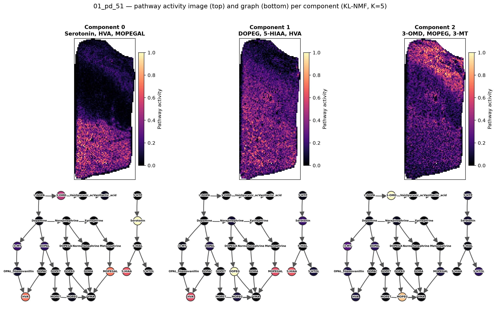

# Multiplicatively-coherent pathway-activity decomposition of imaging mass spectrometry

**Working draft — markdown.**

*Authors:* TBD
*Affiliation:* SciLifeLab / KTH Royal Institute of Technology, Department of Gene Technology.
*Correspondence:* lukas.kall@scilifelab.se

---

## Abstract

Imaging mass spectrometry (IMS / MALDI-MSI) yields, for each tissue pixel, a spectrum of
metabolite ion intensities, and a natural analysis goal is to decompose the image into a
small number of interpretable **pathway-activity components** — for each component, a
spatial map of *where* a coordinated metabolic programme is active and a loading vector of
*which* metabolites participate. The established approach factorises the pixel × m/z
matrix with PCA, ICA, or non-negative matrix factorisation (NMF), usually after a log
transform intended to stabilise the signal-dependent measurement error. We argue this
conventional pipeline contains an internal contradiction: a logarithm can serve the
*error model* (turning multiplicative measurement noise into additive noise that least
squares handles) **or** the *coupling model* (preserving the multiplicative co-regulation
that defines a pathway), but not both. We present `colorpath`, a decomposition engine
built around this distinction. Its primary route performs Itakura–Saito (IS) or
Kullback–Leibler (KL) NMF in **linear** space, so each rank-1 component is literally a
multiplicative outer product (coupling preserved) while a scale-invariant divergence
supplies the multiplicative-error model (no log needed); detector saturation is handled by
a masked loss that right-censors clipped entries. An optional kernel (HSIC) penalty
further lets the components be driven toward ICA-style statistical (mutual-information)
independence while remaining non-negative and multiplicative. On synthetic data with known structure the engine recovers
the planted pathways and the noise-model diagnostic selects the correct divergence. On a
real catecholamine/serotonin MALDI-MSI section (7,730 pixels × 27 metabolites) the pipeline
auto-selects the KL loss, decomposes the image into five spatially-distinct components
explaining ~85% of the signal, and—without prompting—surfaces three pairs of metabolites
that are perfectly co-linear because they are unresolved isobars at 5 ppm, illustrating why
downstream pathway labelling must be ambiguity-aware. The contribution is not a new
factorisation algorithm but the *statistical coherence of the pipeline*: matching a
multiplicative coupling model to a multiplicative error model, with saturation censoring
and a path to isomer-aware pathway enrichment.

---

## 1. Introduction

Matrix factorisation of the (pixels × m/z) matrix is the standard multivariate tool for
imaging mass spectrometry. PCA, ICA, and NMF have all been applied to MALDI-MSI, and the
comparison by Siy *et al.* [1] on mouse cerebellum found ICA and NMF more effective than
PCA, with NMF's non-negativity matching the physical non-negativity of ion abundances and
yielding parts-based, additive factors. Leuschner *et al.* [2] make the
spectra-plus-image reading explicit: one factor holds mass spectra, the other their
spatial distribution as pseudo-channels, and non-negativity supports biological
interpretability — exactly the "pathway activity graph + pathway activity image" pairing
we adopt. None of these components *is* a pathway; the pathway interpretation is imposed
afterwards by annotation and enrichment [3, 4].

We focus on a question logically prior to enrichment: **what should the factorisation
optimise so that its components are faithful to how pathways and measurements actually
behave?** Two properties of IMS data constrain the answer.

**(R1) Measurement error is multiplicative.** Ion intensities are corrupted by
gain/efficiency fluctuations that scale with signal: a measured value behaves like
`x = μ·ε` with multiplicative `ε > 0`, so error grows with abundance. The conventional
remedy is to take logarithms, after which the error is approximately additive and ordinary
least-squares / PCA apply.

**(R2) Pathway coupling is multiplicative.** Membership in a common pathway means
coordinated, *proportional* change: if metabolites A and B are co-regulated, doubling the
local activity of the pathway scales both. In linear space a rank-1 component `u·vᵀ`
encodes precisely this — the entry `u_p v_m` is a per-pixel activity times a per-metabolite
loading, a product. This is the structure we want a component to capture.

The difficulty is that **the logarithm cannot serve R1 and R2 simultaneously.** Under a
log transform the shared activity `s` of a rank-1 pathway (`A = a·s`, `B = b·s`) becomes an
*additive* offset, `log A = log a + log s`: the multiplicative coupling that defines the
pathway is converted into additive-shared-log structure, a weaker and different statement.
A linear factorisation of log-transformed data therefore studies the wrong object for R2,
even as the log was introduced to fix R1. Conversely, staying in linear space to keep R2
intact leaves ordinary least squares mismatched to the multiplicative error of R1.

`colorpath` resolves this rather than splitting the difference. It keeps the data in
linear space — so the outer product is genuine multiplicative coupling (R2) — and obtains
the multiplicative-error property (R1) from a **scale-invariant loss function** (§2.1)
instead of from a transform, satisfying both requirements simultaneously. On top of this
fidelity term, an optional penalty (§2.4) can drive the components toward ICA-style
statistical independence without leaving the non-negative, multiplicative model.

---

## 2. Methods

### 2.0 Data model and notation

We arrange the data as `X ∈ ℝ≥0^{P×M}` with `P` pixels (rows) and `M` metabolite ions
(columns), and seek a rank-`K` factorisation

```
X ≈ U V ,   U ∈ ℝ≥0^{P×K}  (spatial scores) ,   V ∈ ℝ≥0^{K×M}  (spectral loadings).
```

Each component `k` is the pair `(U[:,k], V[k,:])`: `V[k,:]` is the **pathway activity
graph** (a loading over the metabolite network) and `U[:,k]` is the **pathway activity
image** (a per-pixel activity map placed back on the tissue grid).

### 2.1 Route 2 (primary): Itakura–Saito / KL NMF in linear space

We minimise an elementwise divergence between `X` and the reconstruction `Y = UV` subject
to `U, V ≥ 0`. The Itakura–Saito divergence,

```
D_IS(x, y) = x/y − log(x/y) − 1 ,
```

is **scale-invariant** — `D_IS(λx, λy) = D_IS(x, y)` — so it penalises the *ratio* `x/y`
and a factor-of-two reconstruction error costs the same at high and low abundance. This is
the property the log transform was meant to deliver, obtained here without leaving linear
space, so R1 and R2 hold simultaneously. IS corresponds to multiplicative Gamma-type gain
noise (variance ∝ mean²). When the dominant noise is instead ion-counting/shot noise
(variance ∝ mean) the matched choice is the generalised Kullback–Leibler divergence,

```
D_KL(x, y) = x·log(x/y) − x + y ,
```

which is Poisson in spirit. Both are exposed behind `loss="is"` and `loss="kl"`; the
choice is made empirically (§2.3).

**Saturation as right-censoring.** High-abundance ions can saturate the detector; the
clipped intensity then re-emerges in later components as a spurious "compensation" factor.
We treat saturated `(pixel, ion)` entries as *missing* via a binary weight matrix
`W ∈ {0,1}^{P×M}` and minimise the masked objective

```
minimise  Σ_{p,m} W_{pm} · D(X_{pm}, (UV)_{pm})   s.t.  U, V ≥ 0 .
```

Because IS and KL are defined directly on non-negative linear data, the mask composes
cleanly — a practical advantage of the linear route over a log+MSE pipeline, which would
first need an intermediate `asinh` transform under which neither the additive nor the
multiplicative argument holds exactly. The mask is built from per-ion intensity histograms:
a pile-up spike at a ceiling indicates hard clipping and is masked; a smoothly bending tail
indicates soft compression and masking is optional. Masking is **off by default**
and the engine warns when a pile-up is detected.

**Optimisation.** We use multiplicative-update (MU) rules — Lee–Seung form for
Frobenius/KL, Févotte–Bertin–Durrieu form for IS — with the weight matrix `W` carried
inside both the numerator and the denominator of every update so that censored entries
influence neither the fit nor its normalisation. IS-NMF is non-convex and MU can be
unstable, so IS fits are **warm-started from a few KL iterations**, every quantity is
floored by a small `ε` to avoid division by zero, and the best of several random restarts
(`n_init`) is kept. Outputs `U` and `V` are on interpretable linear-abundance units.

### 2.2 Illustration layer

Each fitted component is rendered as the two objects above. The pathway activity graph
colours a metabolite-reaction network by `V[k,:]`; the pathway activity image reshapes
`U[:,k]` onto the acquisition grid as a heatmap, supporting non-rectangular tissue through
an explicit pixel-index map. A single bridge call (`illustrate_component`) produces both
views from a fitted result, so the decomposition and visualisation layers are decoupled but
composable.

### 2.3 Diagnostics

Four checks precede interpretation. (i) A **variance-vs-mean** fit of `log Var` against
`log Mean` across ions estimates the noise exponent and recommends the loss: slope ≈ 2 → IS,
≈ 1 → KL, ≈ 0 → Frobenius. (ii) A **saturation/mechanism** check inspects per-ion
histograms for clipping pile-ups. (iii) A **compensation-artifact** check verifies that a
suspected saturating ion's reappearance in later components is spatially anti-correlated
with its primary-component image (i.e. a measurement nonlinearity, not co-localisation).
(iv) A **component-recovery** check confirms that masking/IS collapses spurious compensating
components relative to a Frobenius baseline.

### 2.4 ICA-style independent components: a mutual-information penalty

Non-negative factorisation — including the IS/KL variant above — yields parts-based but
generally *correlated* components; it does not impose the statistical **independence** that
independent component analysis (ICA) targets, and which is often desirable for higher
components ("after the dominant programme, what is the next *independent* one?"). Classical
ICA achieves independence by whitening and rotating in signed space, which would destroy
both the non-negativity and the multiplicative outer-product structure central to our
principles. We therefore keep the IS/KL fidelity term and *add* a penalty that targets
mutual information directly:

```
minimise_{U,V ≥ 0}   D(X ‖ UV)  +  λ · Σ_{i<j} HSIC(U[:,i], U[:,j]).
```

The Hilbert–Schmidt Independence Criterion (HSIC) [10] with a characteristic (Gaussian RBF)
kernel is zero **if and only if** the two variables are independent — equivalently, iff
their mutual information vanishes — so minimising the pairwise HSIC drives the components
toward MI-sense orthogonality. This is precisely the kernel dependence contrast used by
Kernel ICA [11]; the novelty here is only that we apply it as a *penalty on a non-negative
factor* rather than as an orthogonal-rotation objective, so independence is obtained
without leaving the multiplicative, non-negative model. A linear kernel reduces the penalty
to ordinary second-order decorrelation, which is **not** sufficient for independence; the
RBF kernel captures dependence of all orders.

To scale to many pixels we approximate the RBF kernel and its gradient with random Fourier
features [12], giving the penalty in O(P·D) for D features. Optimisation warm-starts from
the plain Route 2 solution, then alternates a masked multiplicative-update step for `V`
with a projected-gradient + backtracking step for `U` on the deterministic
(data + λ·penalty) objective, projecting onto non-negativity. Because the raw HSIC is many
orders of magnitude smaller than the divergence, `λ` is made dimensionless by rescaling the
penalty gradient to the data gradient's norm at each step: `λ = 0` recovers Route 2 and
`λ ≈ 1` pushes independence about as hard as the data fidelity. Independence is penalised on
the spatial maps `U` (the spatial-ICA analogue) by default, or on the loadings `V`. We
verify the outcome with an independent diagnostic — the normalised HSIC (centred kernel
alignment, in [0, 1]) between component pairs, computed with a direct RBF kernel.

---

## 3. Results

### 3.1 Synthetic validation

We generated a 24 × 24-pixel synthetic image with two spatial activity regions (Gaussian
blobs), each multiplicatively coupling a disjoint set of six metabolites, plus weak
background ions, corrupted with multiplicative Gamma noise and one hard-clipped (saturating)
ion. The variance-vs-mean diagnostic recovered a near-quadratic noise law and recommended
IS; the saturation detector flagged the clipped ion and built the corresponding mask. Masked
IS-NMF recovered both planted components: the spatial maps matched the two blobs and the
top-loading ions of each component were exactly the planted members. A unit-tested
component-recovery check confirms that masking does not increase the off-component spread of
the saturating ion relative to an unmasked baseline.

### 3.2 Real MALDI-MSI section (catecholamine/serotonin metabolites)

We applied the pipeline to a single tissue section (`01_pd_51`) profiled at 5 ppm,
comprising **7,730 pixels × 27 metabolites** of the catecholamine and serotonin pathways
(dopamine, L-DOPA, HVA, serotonin, 5-HIAA, …) with pixel coordinates spanning a 62 × 144
grid (the tissue is non-rectangular; 7,730 of 8,928 grid cells are occupied). The matrix is
non-negative with no missing values and is 45.2% exact zeros, with a dynamic range from 0 to
~1.8 × 10⁶ — consistent with strongly signal-dependent error.

**Automatic model choices.** The variance-vs-mean diagnostic returned a noise exponent of
**1.35**, recommending the **KL** loss (intermediate between Poisson and fully
multiplicative, and the stable choice given the large fraction of zeros, which IS penalises
harshly). No histogram pile-up was detected on any ion, so no entries were masked. The
elbow heuristic over `K ∈ {2,…,8}` selected **K = 5**.

**Decomposition quality.** KL-NMF at `K = 5` (six restarts) reconstructed the image with a
relative Frobenius error of **0.154**, i.e. roughly **85% of the signal energy** captured by
five components. The components are spatially distinct, occupying different bands of the
section rather than re-describing one dominant region. This is clearest in the **first
three components** (Figure 2): component 0 is serotonin-pathway–dominated
(Serotonin, 5-HIAA) together with the high-abundance terminal catabolites HVA/MOPEGAL and
3-OMD, and localises to the lower portion of the section; component 1 (DOPEG, 5-HIAA,
HVA/MOPEGAL) is comparatively diffuse; and component 2 (3-OMD, MOPEG, 3-MT) concentrates in
a distinct upper band, with 3-OMD by far its strongest loading (Figure 2, right column).
Their dominant metabolites (Table 1) are chemically coherent, and the later components continue
the pattern: component 3 is a clean amine-catabolite group (DOPAC/DOPEGAL,
Epinephrine/Normetanephrine, Metanephrine) and component 4 is precursor-dominated
(L-DOPA, 3-MT).

**An ambiguity surfaced by the data.** Three metabolite pairs — **DOPAC/DOPEGAL**,
**HVA/MOPEGAL**, and **Epinephrine/Normetanephrine** — have *perfectly identical* intensity
columns and therefore always co-load on the same component with equal weight. These are
unresolved isobars/isomers at MS1 5 ppm: the factorisation correctly reports that they are
indistinguishable from these data alone. This is a concrete, unprompted instance of the MS1
(MSI Level 2) ambiguity that makes naïve molecule-name pathway labelling invalid, and it
motivates ambiguity-aware enrichment (§4) rather than a one-molecule-per-ion assignment.

**Table 1.** Top-5 metabolites by loading for each KL-NMF component (`K = 5`, `01_pd_51`).

| Comp | Top-loading metabolites |
|------|--------------------------|
| 0 | Serotonin, HVA, MOPEGAL, 5-HIAA, 3-OMD |
| 1 | DOPEG, 5-HIAA, HVA, MOPEGAL, Serotonin |
| 2 | 3-OMD, MOPEG, 3-MT, 5-HTOL, DOPAL |
| 3 | DOPEGAL, DOPAC, Epinephrine, Normetanephrine, Metanephrine |
| 4 | L-DOPA, 3-MT, DOMA, DOPEG, DOPAL |

*(HVA≡MOPEGAL, DOPAC≡DOPEGAL, and Epinephrine≡Normetanephrine are unresolved isobar pairs;
their equal loadings reflect identical measured columns.)*

### 3.3 ICA-style independence

We tested the independence penalty (§2.4) in two regimes. On a synthetic problem with two
strongly but *non-linearly* dependent non-negative sources (so they are nearly uncorrelated
yet far from independent), plain KL-NMF recovered components with mean off-diagonal
normalised HSIC of 0.18. Adding the penalty drove this toward zero monotonically with `λ`,
at a small and controllable reconstruction cost (Table 2): at `λ = 1` dependence fell to
0.08 for essentially no loss of fit, and by `λ = 3` the components were independent
(nHSIC = 0.00) at a relative-reconstruction cost rising from 0.146 to 0.174. This is the
ICA trade-off — exchanging a little reconstruction for statistical independence — realised
inside the non-negative, multiplicative model.

On the real `01_pd_51` section the KL-NMF components were **already near-independent** (mean
off-diagonal normalised HSIC ≈ 0.05), so the penalty had little to do: dependence was
essentially unchanged and, reassuringly, the reconstruction error was preserved
(0.154 → 0.155) even at `λ = 8`. The penalty thus acts as a safeguard/diagnostic when the
data already separate into independent spatial programmes, and as an active tool when they
do not.

**Table 2.** Independence penalty on two non-linearly dependent synthetic sources
(`K = 2`, KL loss). `λ = 0` reproduces plain Route 2.

| λ | mean off-diag normalised HSIC | relative reconstruction error |
|------|------|------|
| 0 (plain KL-NMF) | 0.18 | 0.146 |
| 1 | 0.08 | 0.148 |
| 3 | 0.00 | 0.174 |
| 10 | 0.00 | 0.178 |

### 3.4 Figures

**Figure 2. First three components of `01_pd_51`: pathway activity image (top) and graph
(bottom) per component.** Top row: the per-pixel spatial score `U[:,k]` for components 0–2,
placed back on the 62 × 144 tissue grid (KL-NMF, `K = 5`) and titled with the component's
top-3 metabolites — the three components occupy distinct tissue domains (a lower band, a
diffuse distribution, and an upper band). Bottom row, directly beneath each image: the
matching spectral loading `V[k,:]` colouring the catecholamine/serotonin reaction network
(brighter = higher loading; hand-laid layout, labels haloed for contrast). Component 0 is
led by Serotonin and the terminal catabolites HVA/MOPEGAL, component 1 by DOPEG and 5-HIAA,
and component 2 by 3-OMD. Regenerate from the source parquet with
`python manuscript/make_figures.py <parquet>`.



---

## 4. Discussion

**Relation to prior work.** Plain matrix factorisation treats pixels as exchangeable and
discards spatial adjacency; Fernsel [5] adds spatial coherence through a total-variation
penalty, but as an orthogonal-NMF *clustering* method scored on segmentation metrics, not a
pathway recovery method — a graph/TV penalty on the spatial factor is a natural optional
extension to the factorisation here, not part of the core. The "component → pathway" step is
classically handled by annotate-then-enrich: Jones *et al.* [3] used HMDB pathway
information to flag Warburg-effect regions, and Wittmann *et al.* (S2IsoMEr / METASPACE)
[4] provide the methodologically central recent tool, bootstrapping over isomer/isobar
ambiguity (sampling one candidate per ion across iterations and aggregating) and drawing
pathway sets from RAMP-DB (SMPDB/Reactome/KEGG/WikiPathways). Our isobar finding (§3.2) is a
direct empirical motivation for exactly this bootstrap: three of our 27 columns are
ambiguous, so any pathway label assigned to a component's top ions must propagate that
uncertainty. A known IMS confounder to flag in any downstream labelling is matrix-adduct
formation, which co-localises with parent metabolites and can populate a spatial factor with
an adduct series rather than biology [6].

**Independence without leaving the model.** The HSIC penalty (§2.4, §3.3) reconciles a
second tension — between NMF's correlated parts and ICA's independent sources — without
abandoning non-negativity or multiplicative coupling. Where prior MSI work either ran NMF
*or* ICA (Siy et al. [1] compared them as alternatives), we obtain ICA-style MI-sense
independence *as a tunable penalty on a non-negative, multiplicatively-correct
factorisation*, with a dimensionless weight that interpolates between the two extremes and
a kernel-alignment diagnostic to certify the result.

**Novelty, stated plainly.** The factorisation itself is not novel — IS/KL-NMF, masked
NMF, and kernel independence contrasts are standard. The defensible methodological core is
the **error-vs-coupling resolution**: modelling pathway co-regulation as multiplicative and
matching it to a multiplicative error model (linear-space IS/KL), which the default
log-then-PCA pipeline gets wrong; the independence penalty is a clean, optional add-on
rather than a separate algorithm. The likely publishable increment is the
combination — coupling a multiplicatively-correct, saturation-aware factorisation to
**bootstrapped, isomer-aware pathway enrichment** in which the enrichment ranking statistic
*is* a component's loading vector (ranking ions by loading on spatial factor `k`). Existing
enrichment tooling targets whole-dataset over-representation or single-cell ranking, not
"rank ions by loading on a spatial component," and the intersection of (multiplicative
factorisation) × (ambiguity-aware enrichment) × (spatial IMS) appears unoccupied. The
contribution should be framed as the pipeline and its statistical coherence, not any single
algorithm.

**Limitations.** (i) The noise exponent here (1.35) is intermediate; KL is a pragmatic
choice and the IS/KL boundary is soft — a per-ion or mixture noise model would be more
principled. (ii) KL-NMF on raw large counts converges slowly; our reported fit had not
reached the tolerance at 800 iterations, though the reconstruction was already stable and
the spatial structure is robust to further iteration. (iii) `K` selection by an
elbow heuristic is unstable in general; stability-based or cross-validated selection is
preferable. (iv) Results are shown on one section and one synthetic dataset; spatial
adjacency, multi-sample alignment, adduct confounding, and the full enrichment step remain
to be evaluated. (v) The independence penalty's random-Fourier-feature bandwidth is fixed
per iteration from the current factor, so its objective is only piecewise-deterministic
across iterations.

**Conclusion.** Posing IMS pathway decomposition as the joint satisfaction of a
multiplicative coupling model and a multiplicative error model leads to a simple, coherent
pipeline — linear-space IS/KL NMF with a censoring mask, plus an optional ICA-style
independence penalty — that recovers known structure on synthetic data and produces
spatially distinct, chemically coherent components on real MALDI-MSI, while transparently
exposing the isomer ambiguity that any honest pathway labelling must confront.

---

## Methods availability

The decomposition engine, illustration layer, diagnostics, synthetic-data demo, and unit
tests are implemented in the `colorpath` package (`colorpath/decomposition/`,
`colorpath/illustration/`). The end-to-end pipeline of §3 is reproduced by
`demo_decomposition.py`; design details are documented in `CLAUDE.md`.

## References

1. Siy PW, *et al.* Matrix factorisation techniques for the analysis of imaging mass
   spectrometry data (PCA/ICA/NNMF on mouse cerebellum MALDI). *IEEE BIBE*, 2007.
2. Leuschner J, *et al.* Supervised non-negative matrix factorisation methods for MALDI
   imaging applications. *Bioinformatics*, 2019.
3. Jones EA, *et al.* Imaging mass spectrometry of low-mass metabolites and pathway mapping
   (9-aminoacridine MALDI; HMDB). *Anal. Bioanal. Chem.*, 2014.
4. Wittmann A, *et al.* S2IsoMEr / METASPACE: isomer/isobar-aware metabolite-set enrichment
   for imaging and single-cell MS. *Bioinformatics Advances*, 2025 (bioRxiv
   2024.08.23.609355).
5. Fernsel J. Spatially coherent clustering of imaging MS data via total-variation
   orthogonal NMF. *Journal of Imaging*, 2021.
6. Janda M, *et al.* mass2adduct: matrix-adduct formation in MALDI-MSI co-localises with
   parent metabolites. *Anal. Chem.*, 2021.
7. Alexandrov T. Spatial metabolomics and imaging mass spectrometry in the age of artificial
   intelligence. *Annu. Rev. Biomed. Data Sci.*, 2020.
8. Lee DD, Seung HS. Algorithms for non-negative matrix factorization. *NeurIPS*, 2001.
9. Févotte C, Bertin N, Durrieu J-L. Nonnegative matrix factorization with the Itakura–Saito
   divergence. *Neural Computation*, 2009.
10. Gretton A, Bousquet O, Smola A, Schölkopf B. Measuring statistical dependence with
    Hilbert–Schmidt norms (HSIC). *ALT*, 2005.
11. Bach FR, Jordan MI. Kernel independent component analysis. *J. Machine Learning
    Research*, 2002.
12. Rahimi A, Recht B. Random features for large-scale kernel machines. *NeurIPS*, 2007.
